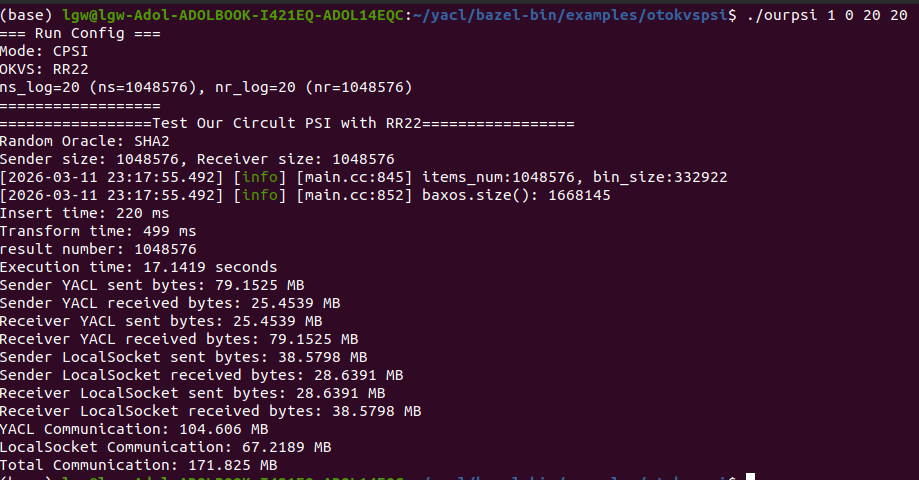
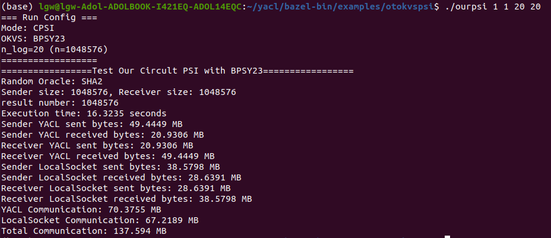
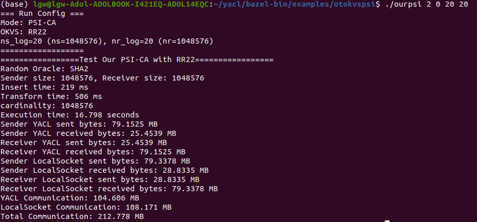
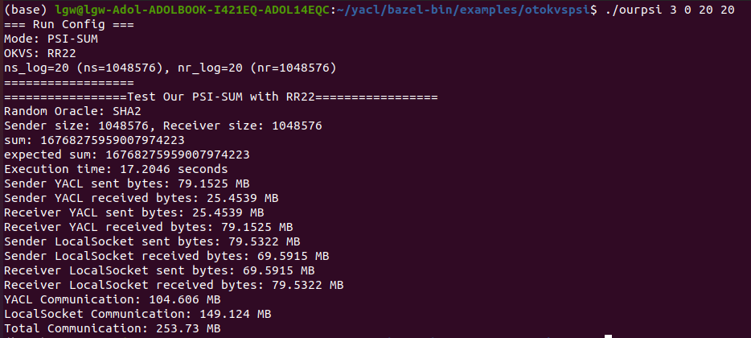
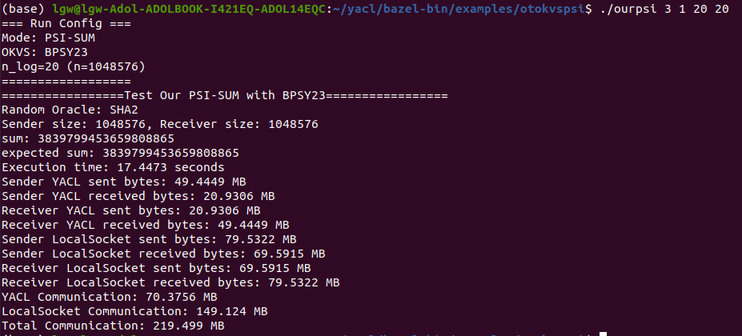
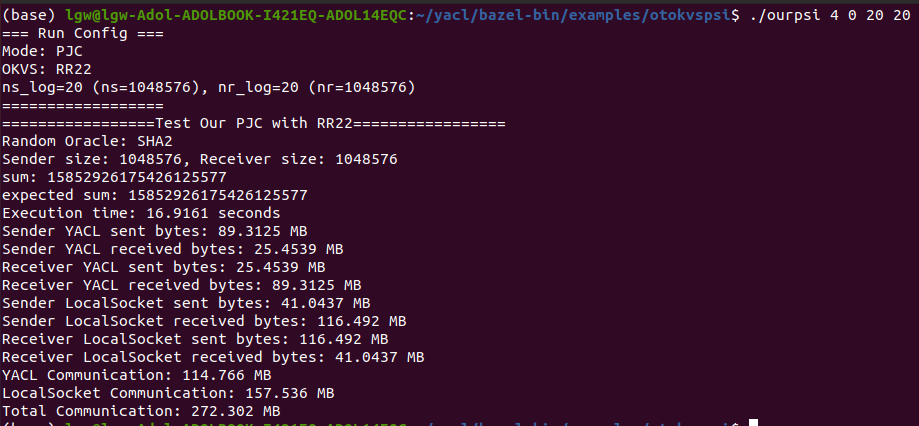
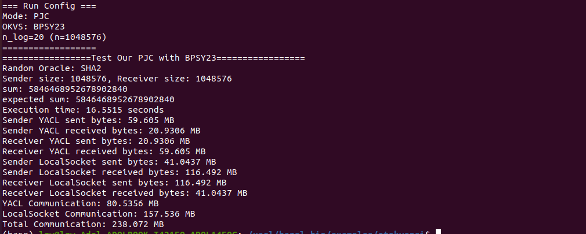

# OurPSI Docker Quick Start

This is the implementation of our **NDSS 2026** accepted paper *“Faster Than Ever: A New Lightweight Private Set Intersection and Its Variants”*.

## Build Image

```bash
docker build -t shallmate/ourpsi:latest .
```

## Note

* **Insufficient base OTs + flaw in Hybrid 5.** Using only $\lambda+\log(n_s n_r)$ base OTs is insufficient in both the semi-honest and malicious settings: if $\mathsf{Decode}(P,x)$ has Hamming weight $t$, then for any $x$ outside the intersection the adversary only needs to guess those $t$ bits of the secret mask $s$ (since $\mathsf{Decode}(P,x)$ is combined with $s$ via bitwise AND) to form the random-oracle input. Thus, we would need $\mathsf{Decode}(P,x)$ to have Hamming weight $\kappa$ with high probability. Our Hybrid~5 incorrectly ignores the case where the adversary makes these queries *after* receiving $\omega$; fixing this would increase communication by roughly $4$--$5\times$. In the malicious setting, an adversary may also choose $P$ so that $\mathsf{Decode}(P,x,r)$ has low Hamming weight, so our claimed malicious security does not hold under such choices of $P$.

* **Circuit-based PSI unaffected.** Our circuit-based PSI claims remain valid: the transmitted OKVS P (in step 6) is still indistinguishable from uniform due to the fresh independent randomization values $r_i$, so the above issue does not apply to that setting.

* **Corrections to the implementations of CPSI, PSI-CA, PSI-SUM, and PJC.** In our previous implementation, we relied on SPU to evaluate the downstream arbitrary circuits. However, since SPU depends on a trusted third party, this was not a fair comparison and led to a significant performance bias. To address this issue, we re-implemented a genuine third-party-free circuit evaluation protocol. The concrete results are illustrated in the example figure below. They can also be reproduced by running our code.

## Run in Container

```bash
docker run --rm -it --platform linux/amd64 shallmate/ourpsi:latest /bin/bash
cd /opt/yacl/bazel-bin/examples/otokvspsi/
```

The main demo binary is:

```bash
./ourpsi
```

## Supported Modes

* `PSI` (`arg1=0`): private set intersection
* `CPSI` (`arg1=1`): cardinality/private-cardinality PSI demo
* `PSI-CA` (`arg1=2`): prints intersection cardinality as `cardinality`
* `PSI-SUM` (`arg1=3`): prints the aggregated intersection value as `sum`
* `PJC` (`arg1=4`): prints the private join computation result as `sum`

Both numeric shorthand and explicit flags are supported.

## Arguments

### Numeric shorthand

```bash
./ourpsi <arg1> <arg2> [size logs...]
```

* `arg1`: `0` = PSI, `1` = CPSI, `2` = PSI-CA, `3` = PSI-SUM, `4` = PJC
* `arg2`: `0` = RR22, `1` = BPSY23
* If `arg2=0` (RR22): provide `arg3=log2(n_s)` and `arg4=log2(n_r)`
* If `arg2=1` (BPSY23): provide only `arg3=log2(n)`

### Explicit flags

```bash
./ourpsi --mode=psi|cpsi|psica|psisum|pjc --okvs=rr22|bpsy23 \
  --ns-log=K --nr-log=L --n-log=M
```

* RR22 requires `--ns-log` and `--nr-log`
* BPSY23 requires `--n-log`

## Examples

### PSI

```bash
./ourpsi 0 0 24 24
```


```bash
./ourpsi 0 1 24
```


### CPSI

```bash
./ourpsi 1 0 20 20
```


```bash
./ourpsi 1 1 20
```


### PSI-CA

```bash
./ourpsi 2 0 20 20
```


```bash
./ourpsi 2 1 20
```


Equivalent flag form:

```bash
./ourpsi --mode=psica --okvs=rr22 --ns-log=20 --nr-log=20
./ourpsi --mode=psica --okvs=bpsy23 --n-log=20
```

Typical output includes:

```text
cardinality: ...
Execution time: ...
```

### PSI-SUM

```bash
./ourpsi 3 0 20 20
```


```bash
./ourpsi 3 1 20
```


Equivalent flag form:

```bash
./ourpsi --mode=psisum --okvs=rr22 --ns-log=20 --nr-log=20
./ourpsi --mode=psisum --okvs=bpsy23 --n-log=20
```

Typical output includes:

```text
sum: ...
expected sum: ...
Execution time: ...
```

### PJC

```bash
./ourpsi 4 0 20 20
```


```bash
./ourpsi 4 1 20
```


Equivalent flag form:

```bash
./ourpsi --mode=pjc --okvs=rr22 --ns-log=20 --nr-log=20
./ourpsi --mode=pjc --okvs=bpsy23 --n-log=20
```

Typical output includes:

```text
sum: ...
expected sum: ...
Execution time: ...
```

## Usage Guide

Run without arguments to print the built-in usage:

```bash
cd /opt/yacl/bazel-bin/examples/otokvspsi/
./ourpsi
```

If you hit a permission error:

```bash
chmod +x ./ourpsi
./ourpsi
```

## Folder & File Overview

### `otokvspsi/`

* **Purpose:** Full implementation under YACL for **PSI**, **CPSI**, **PSI-CA**, **PSI-SUM**, and **PJC**, with two OKVS backends (**RR22** and **BPSY23**).
* **Binary output (after build):** `/opt/yacl/bazel-bin/examples/otokvspsi/ourpsi`
* **Quick usage example:**

  ```bash
  cd /opt/yacl/bazel-bin/examples/otokvspsi/
  ./ourpsi 2 0 20 20
  ```

  This runs **PSI-CA** with **RR22 OKVS**, where the sender size is `2^20` and the receiver size is `2^20`.
* **Arguments:**

  * `arg1`: `0` = PSI, `1` = CPSI, `2` = PSI-CA, `3` = PSI-SUM, `4` = PJC
  * `arg2`: `0` = RR22, `1` = BPSY23
  * RR22: `arg3=log2(n_s)`, `arg4=log2(n_r)`
  * BPSY23: `arg3=log2(n)`
* **Tip:** If you hit a permission error, run `chmod +x ./ourpsi`

---

### `Dockerfile`

* **Purpose:** Reproducible Ubuntu 20.04 build/runtime environment for OurPSI.
* **What it does (high level):** Installs GCC-11/G++-11, CMake 3.24.2, `cryptoTools` (with Boost/RELIC), Bazel 6.5.0, then builds the `otokvspsi` demo under YACL.
* **Common commands:**

  ```bash
  docker build -t shallmate/ourpsi:latest .
  docker run --rm -it shallmate/ourpsi:latest
  ```

---
