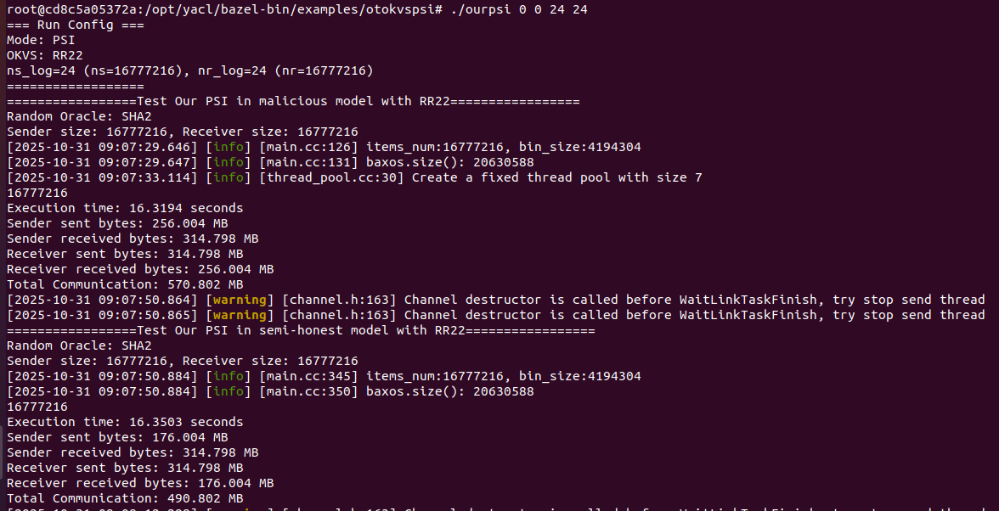
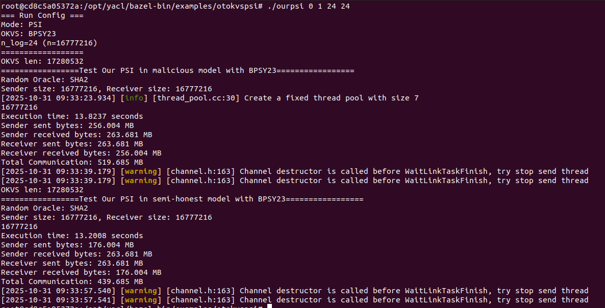
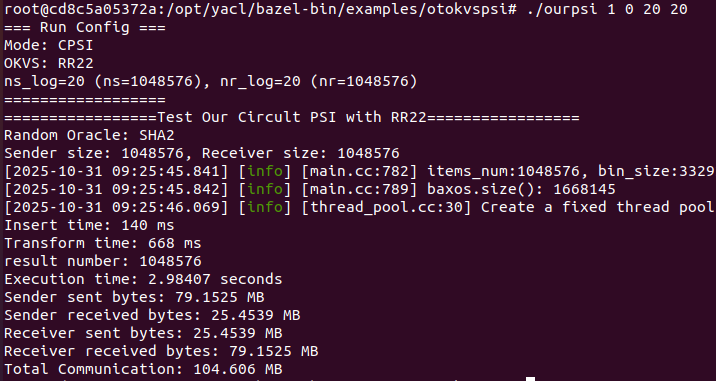
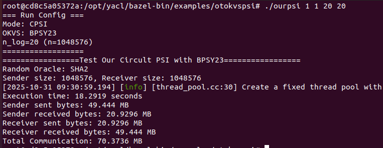

# OurPSI Docker Quick Start

## Build Image

```bash
docker build -t shallmate/ourpsi:latest .
```

## Run & Example

After entering the container:

```bash
docker run --rm -it --platform linux/amd64 shallmate/ourpsi:latest /bin/bash
cd /opt/yacl/bazel-bin/examples/otokvspsi/
./ourpsi 0 0 20 20
```

The example above runs **PSI** (`arg1=0`) using **RR22** OKVS (`arg2=0`) with sender size `2^20` and receiver size `2^20`.

## Arguments

* **arg1**: `0` = PSI, `1` = CPSI
* **arg2**: `0` = OKVS in RR22, `1` = OKVS in BPSY23
* **arg3**:

  * If `arg2=0` (RR22): `log2(n_s)` — log of sender size
  * If `arg2=1` (BPSY23): `log2(n)` — log of (symmetric) set size
* **arg4 (RR22 only)**: `log2(n_r)` — log of receiver size

## Examples

```bash
./ourpsi 0 0 24 24
```


```bash
./ourpsi 0 1 24 24
```


```bash
./ourpsi 1 0 20 20
```


```bash
./ourpsi 1 1 20 20
```



## Usage Guide

Run without arguments to print the built-in usage:

```bash
cd /opt/yacl/bazel-bin/examples/otokvspsi/
./ourpsi
```

> If you hit a permission error:

```bash
chmod +x ./ourpsi && ./ourpsi
```

## Folder & File Overview

### `otokvspsi/`

* **Purpose:** Full implemention under YACL that contains demo code for **Our PSI protocols** and showcases two OKVS options (**RR22** and **BPSY23**). Building produces the `ourpsi` binary used to run PSI/CPSI examples.
* **Binary output (after build):**
  `/opt/yacl/bazel-bin/examples/otokvspsi/ourpsi`
* **Quick usage example:**

  ```bash
  cd /opt/yacl/bazel-bin/examples/otokvspsi/
  ./ourpsi 0 0 20 20
  ```

  This runs **PSI** with **RR22 OKVS**, where the sender size is `2^20` and the receiver size is `2^20`.
* **Arguments:**

  * `arg1`: `0` = PSI, `1` = CPSI
  * `arg2`: `0` = OKVS in RR22, `1` = OKVS in BPSY23
  * `arg3`:

    * If `arg2=0` (RR22): `log2(n_s)` — log of sender size
    * If `arg2=1` (BPSY23): `log2(n)` — log of (symmetric) set size
  * `arg4` (RR22 only): `log2(n_r)` — log of receiver size
* **Tip:** If you hit a permission error: `chmod +x ./ourpsi`

---

### `Dockerfile`

* **Purpose:** Reproducible Ubuntu 20.04 build/runtime environment for OurPSI.
* **What it does (high level):**
  Installs GCC-11/G++-11 → CMake 3.24.2 → builds and installs `cryptoTools` (with Boost/RELIC) → installs Bazel 6.5.0 → clones/configures `yacl` → copies `otokvspsi/` into the image → builds with Bazel (`-std=c++17`, `-ldl`).
* **Common commands:**

  ```bash
  docker build -t shallmate/ourpsi:latest .
  docker run --rm -it shallmate/ourpsi:latest
  ```

---


